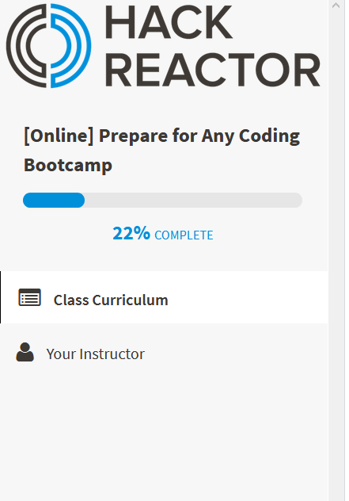

# Angular Extended

#### Epicodus JavaScript Week 4 Project, September 29, 2017

#### By Stephanie Mayer

## Table Of Contents
* [Description](#description)
* [Accomplishments Of Today](#accomplishments-of-today)
* [What I still need to do](#what-i-still-need-to-do)
* [What to do before starting a job](#what-to-do-before-starting-a-job)
* [Questions or Concerns](#questions-or-concerns)
* [Technologies Used](#technologies-used)

## Description
_Further Extend learning on topics of interest including, updating Readme's, practicing white boarding questions, watching some videos on Java and reading up on different Java technical questions._

## Accomplishments of Today
### Goals:
  _The goal for today was to explore options for prepping for interviews. I feel like I am pretty good at working on independent projects, so creating a new project didn't seem like time well spent. Instead, I decided I should update some README's to add a table of contents to make them a little nicer, after the meetup last night. I also wanted to go through a lot of technical interview questions to be prepared for what may come at me. We didn't spend much time in Java prepping for questions that may have come our way in terms of Java. There are some great links below that had some very informative questions and answers. I also practiced some white boarding questions on Hack Reactor and watched some videos on more Java including looking at different types of databases, such as Oracle._

* Edit Current Projects to improve Readme/Code:
  * [Doctor API Project](https://github.com/smayer0926/doctorLookup)
  * [Zoo Project](https://github.com/smayer0926/Zoo)
* Watch videos on Java methods and databases from Udemy.

* Practice on Hack Reactor

* Register to go to UO Alumni Networking Event on October 10th at 5:30.
  * [UO Networking](http://www.uoalumni.com/s/1540/uoaa/index.aspx?sid=1540&gid=3&pgid=7385&cid=16925&ecid=16925&crid=0&calpgid=587&calcid=2644)
* Read through example questions from a technical interview:
  * [Technical Interview Questions](http://www.java2novice.com/java-interview-questions/)
  * [More Technical Interview Questions](https://www.javatpoint.com/corejava-interview-questions)
  * [Even More Questions](http://www.buggybread.com/2015/06/java-interview-questions-and-answers.html)

## What I still need to do
* Watch more videos/practice more Java.
* Study more technical interview questions.
* Connect with more people on LinkedIn.

## What to do before starting a job
### Technical
* I'd like to work more on technical questions related to different languages, specifically Java. We barely scratched the surface of the information that is out there and it would be nice to learn some more stuff. To do this I would need to spend more time on working with videos related to Java and learn more about different database systems.

### Non-technical
* Non-technical issues that I need to work further on would be getting more LinkedIn connections and working on cover letters. Otherwise, I feel pretty ready to continue the search for a job.

## Questions or Concerns
_If there are any questions or concerns, please contact me at smayer0926@gmail.com_

## Technologies Used
* _Atom_
* _Git-Bash_
* _Hack Reactor_

### License

Copyright &copy; 2017 Stephanie Mayer
